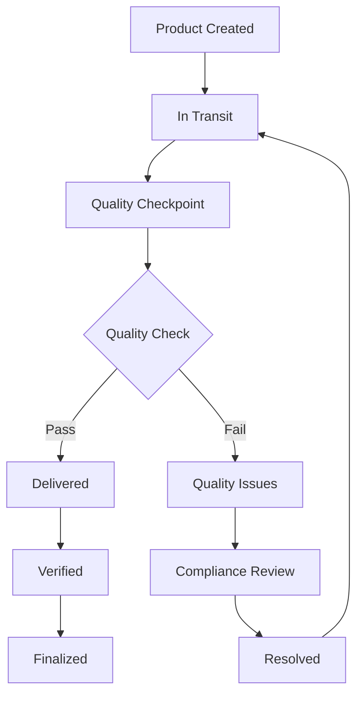

# Decentralized Supply Chain Tracker

A comprehensive blockchain-based supply chain tracking system built on the Stacks network that provides immutable product journey tracking with multi-stakeholder verification and automated quality assurance.

## 🎯 Project Overview

The Decentralized Supply Chain Tracker is an end-to-end solution that addresses the critical challenges in modern supply chain management:

- **Product Authenticity Verification**: Immutable tracking of products from origin to consumer
- **Multi-Stakeholder Collaboration**: Secure verification system involving multiple trusted parties
- **Automated Quality Assurance**: Intelligent quality control checkpoints with automated notifications
- **Compliance Monitoring**: Real-time compliance violation tracking and resolution

## 🏗️ Architecture

### System Components

```
┌─────────────────────────────────────────────────────────────────┐
│                    Stacks Blockchain Layer                      │
├─────────────────────────────────────────────────────────────────┤
│  Product Provenance Tracker    │  Quality Assurance Automation │
│  ────────────────────────────   │  ─────────────────────────── │
│  • Product Registry             │  • Quality Checkpoints        │
│  • Stakeholder Management       │  • Inspector Registry         │
│  • Checkpoint Tracking          │  • Compliance Violations      │
│  • Authenticity Proofs          │  • Automated Notifications    │
└─────────────────────────────────────────────────────────────────┘
```

### State Machine Flow



## 📋 Smart Contracts

### 1. Product Provenance Tracker (`product-provenance-tracker.clar`)

**Purpose**: Immutable product journey tracking with multi-stakeholder verification and authenticity proof

**Key Features**:
- **Stakeholder Registry**: Secure registration and verification of supply chain participants
- **Product Lifecycle Management**: Complete tracking from creation to finalization
- **Checkpoint System**: Detailed logging of product journey milestones
- **Multi-signature Verification**: Requires multiple stakeholder confirmations
- **Authenticity Proofs**: Cryptographic verification of product authenticity

**Main Functions**:
- `register-stakeholder`: Register new supply chain participants
- `create-product`: Initialize new product tracking
- `add-checkpoint`: Log product journey milestones
- `verify-product`: Multi-stakeholder product verification
- `finalize-product`: Complete product journey with full verification

**Contract Size**: 363 lines of code

### 2. Quality Assurance Automation (`quality-assurance-automation.clar`)

**Purpose**: Automated quality control checkpoint system with stakeholder notifications and compliance verification

**Key Features**:
- **Inspector Management**: Certified inspector registration and verification
- **Quality Criteria Framework**: Configurable quality standards and scoring
- **Automated Inspections**: Structured quality checkpoint workflow
- **Compliance Monitoring**: Real-time violation tracking and resolution
- **Notification System**: Automated stakeholder alerts and escalations

**Main Functions**:
- `register-inspector`: Register certified quality inspectors
- `create-quality-checkpoint`: Initialize quality control points
- `complete-inspection`: Finalize quality assessments with scoring
- `report-compliance-violation`: Track and resolve compliance issues
- `send-notification`: Automated stakeholder communication

**Contract Size**: 524 lines of code

## 🚀 Getting Started

### Prerequisites

- **Clarinet CLI**: Version 2.8.0 or higher
- **Node.js**: Version 18+ for testing framework
- **Stacks Wallet**: For blockchain interactions

### Installation

1. **Clone the Repository**
   ```bash
   git clone <repository-url>
   cd decentralized-supply-chain-tracker
   ```

2. **Install Dependencies**
   ```bash
   npm install
   ```

3. **Verify Contract Syntax**
   ```bash
   clarinet check
   ```

### Development Workflow

#### Local Testing

```bash
# Run all contract tests
npm test

# Run specific contract tests
npm test -- product-provenance-tracker
npm test -- quality-assurance-automation

# Check contract syntax and typing
clarinet check

# Interactive contract console
clarinet console
```

#### Contract Deployment

```bash
# Deploy to devnet (local development)
clarinet integrate

# Deploy to testnet
clarinet deploy --testnet

# Deploy to mainnet (production)
clarinet deploy --mainnet
```

## 🔧 Contract Interfaces

### Product Provenance Tracker

#### Core Data Structures

```clarity
;; Product Information
{
  creator: principal,
  name: (string-ascii 100),
  description: (string-ascii 500),
  origin: (string-ascii 100),
  created-at: uint,
  status: uint,
  finalized: bool,
  verification-count: uint
}

;; Stakeholder Registry
{
  name: (string-ascii 100),
  role: (string-ascii 50),
  verified: bool,
  registered-at: uint
}
```

#### Key Functions

**Product Management**:
- `create-product(name, description, origin)` → `uint` (product-id)
- `get-product(product-id)` → `Product Data`
- `update-product-status(product-id, new-status)` → `bool`

**Stakeholder Operations**:
- `register-stakeholder(name, role)` → `principal`
- `verify-stakeholder(stakeholder)` → `bool` (owner only)

**Verification System**:
- `verify-product(product-id, verification-data)` → `bool`
- `generate-authenticity-proof(product-id, confidence-score)` → `buff`

### Quality Assurance Automation

#### Core Data Structures

```clarity
;; Quality Checkpoint
{
  product-id: uint,
  inspector: principal,
  location: (string-ascii 100),
  checkpoint-type: uint,
  status: uint,
  created-at: uint,
  completed-at: (optional uint),
  score: (optional uint)
}

;; Quality Criteria
{
  name: (string-ascii 100),
  description: (string-ascii 300),
  min-score: uint,
  max-score: uint,
  weight: uint,
  mandatory: bool
}
```

#### Key Functions

**Quality Management**:
- `create-quality-checkpoint(product-id, location, type)` → `uint`
- `start-inspection(checkpoint-id)` → `bool`
- `complete-inspection(checkpoint-id, notes)` → `{passed: bool, score: uint}`

**Inspector Operations**:
- `register-inspector(name, certification, specialization)` → `principal`
- `verify-inspector(inspector)` → `bool` (owner only)

**Compliance System**:
- `report-compliance-violation(checkpoint-id, type, severity, description)` → `uint`
- `mark-notification-read(notification-id)` → `bool`

## 📊 Quality Metrics

The system maintains comprehensive quality metrics:

- **Product Quality Score**: Weighted average of all quality checkpoints
- **Compliance Score**: Percentage of passed compliance checks
- **Inspector Performance**: Success rate and total inspections
- **Stakeholder Activity**: Verification participation rates

## 🔐 Security Considerations

### Access Controls
- **Multi-signature verification**: Critical operations require multiple stakeholder confirmations
- **Role-based permissions**: Stakeholders and inspectors have distinct capabilities
- **Owner-only functions**: Contract deployment and verification controls

### Data Integrity
- **Immutable records**: All supply chain events are permanently recorded
- **Cryptographic proofs**: Hash-based verification of authenticity
- **Audit trails**: Complete history of all contract interactions

### Compliance Features
- **Automated monitoring**: Real-time detection of quality violations
- **Escalation protocols**: Critical failures trigger immediate notifications
- **Resolution tracking**: Compliance issues tracked through resolution

## 📈 Monitoring and Analytics

### Key Performance Indicators (KPIs)
- Average time from product creation to finalization
- Quality checkpoint pass/fail ratios
- Stakeholder participation rates
- Compliance violation frequency and resolution times

### Dashboards and Reporting
- Real-time supply chain visibility
- Quality trend analysis
- Stakeholder performance metrics
- Compliance status reports

## 🧪 Testing Strategy

### Unit Testing
- Contract function validation
- Error condition handling
- Access control verification
- Data integrity checks

### Integration Testing
- Multi-contract workflows
- Stakeholder interaction scenarios
- Quality checkpoint processes
- Notification system validation

### Load Testing
- High-volume product tracking
- Concurrent stakeholder operations
- Performance under stress conditions

## 📝 API Documentation

### Read-Only Functions
All contracts provide comprehensive read-only functions for data access without gas costs.

### Public Functions
State-changing functions that require transaction fees and proper authentication.

### Error Codes
Standardized error handling with descriptive error messages:
- `u100-106`: Product Provenance Tracker errors
- `u200-207`: Quality Assurance Automation errors

## 🤝 Contributing

1. Fork the repository
2. Create a feature branch (`git checkout -b feature/amazing-feature`)
3. Commit your changes (`git commit -m 'Add amazing feature'`)
4. Push to the branch (`git push origin feature/amazing-feature`)
5. Open a Pull Request

### Development Guidelines
- Follow Clarity best practices
- Maintain comprehensive test coverage (≥90%)
- Update documentation for new features
- Ensure all contracts pass `clarinet check`

## 📄 License

This project is licensed under the MIT License - see the [LICENSE](LICENSE) file for details.

## 🔗 Links

- **Stacks Documentation**: https://docs.stacks.co/
- **Clarinet Documentation**: https://docs.hiro.so/clarinet/
- **Project Repository**: [GitHub Link]
- **Live Deployment**: [Stacks Explorer Link]

## 📞 Support

For technical support and questions:
- Create an issue in the GitHub repository
- Join the Stacks Discord community
- Review the comprehensive documentation

---

**Built with ❤️ for transparent and secure supply chains**